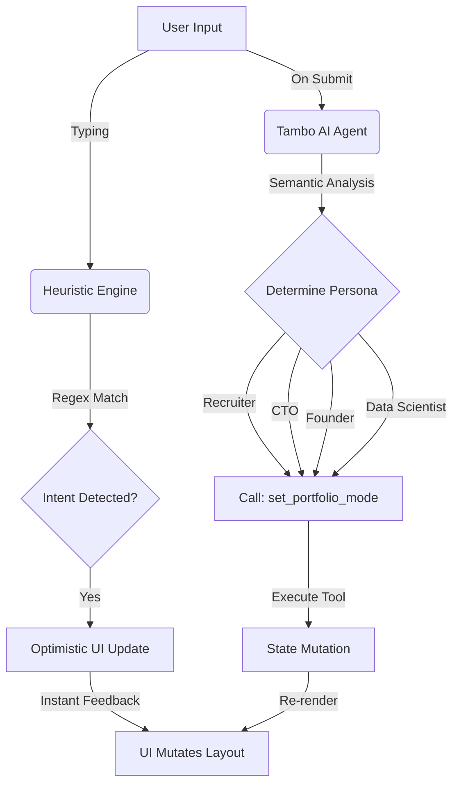

# Anand Vashishtha Generative UI Portfolio

> A Generative UI system that rebuilds itself based on who is viewing it.


## The Problem

Traditional portfolios are static. A Recruiter wants to see a resume. A Founder wants to see MVP speed. A CTO wants to see system architecture.
One static interface cannot serve all three masters.

## The Solution: Generative UI

Chameleon is not a static website. It is an **Intent-Adaptive System**.

1.  **Perceives:** It analyzes visitor intent using a hybrid engine (Heuristic + Tambo AI).
2.  **Reasons:** It determines the optimal content strategy (Recruiter vs. Data Scientist vs. CTO).
3.  **Adapts:** It **mutates the DOM in real-time**, creating a bespoke layout for that specific user.

## How It Works (The "Dual-Layer" Engine)

Chameleon uses a sophisticated two-step inference model to ensure zero-latency UX with high-intelligence accuracy.



1.  **Layer 1: Optimistic Heuristic (0ms)**
    - Immediate regex-based intent classification.
    - Provides instant visual feedback (Layout shift).
2.  **Layer 2: Agentic Confirmation (Async)**
    - The **Tambo AI** agent analyzes the semantic context.
    - It executes the `set_portfolio_mode` tool to lock in the persona.
    - It filters the project database to show only relevant code (e.g., hiding Web3 projects from a Web2 recruiter).

## Tech Stack

- **Core:** React 19, TypeScript, Vite 7
- **AI Engine:** [Tambo AI](https://tambo.ai) (SDK + Tool Calling)
- **State Mutation:** Framer Motion (Layout Animations)
- **Styling:** Tailwind CSS v4 (Neo-Brutalist Design)

## Key Features

- **4 Distinct Personas:** Recruiter, Founder, CTO, Data Scientist.
- **Domain-Aware Project Filtering:** A Data Scientist sees "Model Accuracy." A Founder sees "Time-to-Market."
- **Agent Engine Optimization (AEO):** Includes `llms.txt` for machine readability.

## Running Locally

```bash
npm install
npm run dev
```

---

_Built by [Anand Vashishtha](https://0xanand.tech)_
